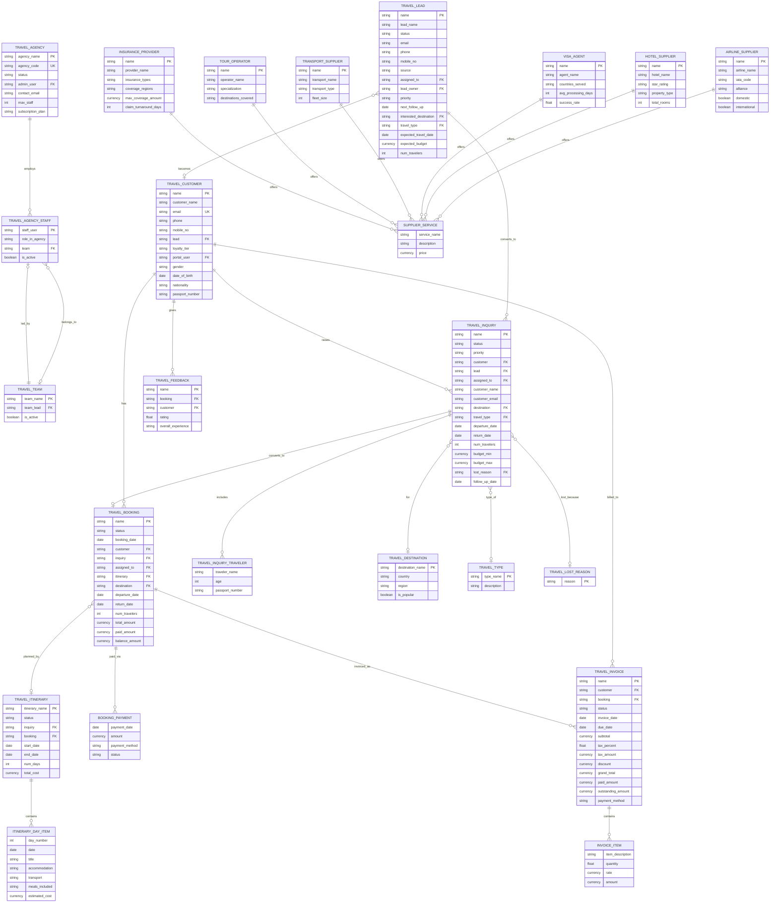

# Horizon CRM — Data Model Reference

**Version:** 3.1  
**Date:** 2026-04-01  

---

## Entity Relationship Diagram (Mermaid)

---

## Lead vs Inquiry — Workflow Separation

**Travel Lead** and **Travel Inquiry** are intentionally separate doctypes with distinct responsibilities:

| Aspect | Travel Lead | Travel Inquiry |
|--------|------------|----------------|
| **Stage** | Pre-qualification | Formal travel request |
| **Pipeline** | New → Contacted → Interested → Qualified → Converted → DNC | New → Contacted → Quoted → Won → Lost |
| **Customer** | Not required (prospecting) | Required (customer_name mandatory) |
| **Budget** | Single estimate (`expected_budget`) | Range (`budget_min` / `budget_max`) |
| **Dates** | Optional (`expected_travel_date`) | Specific (`departure_date`, `return_date`) |
| **Next step** | Convert to Inquiry or Customer | Convert to Booking |
| **Lost tracking** | N/A | `lost_reason` + `lost_detail` (mandatory when Lost) |
| **Travelers** | Count only (`num_travelers`) | Child table with passport/age details |

**Conversion flow:** Lead (Qualified) → Create Inquiry → Inquiry (Won) → Create Booking

The overlapping fields (destination, travel_type, num_travelers, source) exist intentionally to pre-fill the Inquiry when converting from a Lead.

---

## Supplier Categories (v3.0)

The generic `Travel Supplier` has been replaced with six category-specific doctypes:

| DocType | Prefix | Category-Specific Fields |
|---------|--------|---------------------------|
| Airline Supplier | AIR- | iata_code, alliance, hub_airports, domestic/international/charter |
| Hotel Supplier | HTL- | star_rating, property_type, total_rooms, check-in/out times, amenities |
| Visa Agent | VISA- | countries_served, visa_types, avg_processing_days, success_rate, express |
| Transport Supplier | TRN- | transport_type, fleet_size, vehicle_types, max_passengers |
| Tour Operator | TOUR- | specialization, destinations_covered, group_size, languages |
| Insurance Provider | INS- | insurance_types, coverage_regions, max_coverage_amount, claim_turnaround_days |

All share: contact info, address, notes, and a `services` child table (`Supplier Service`).

---
