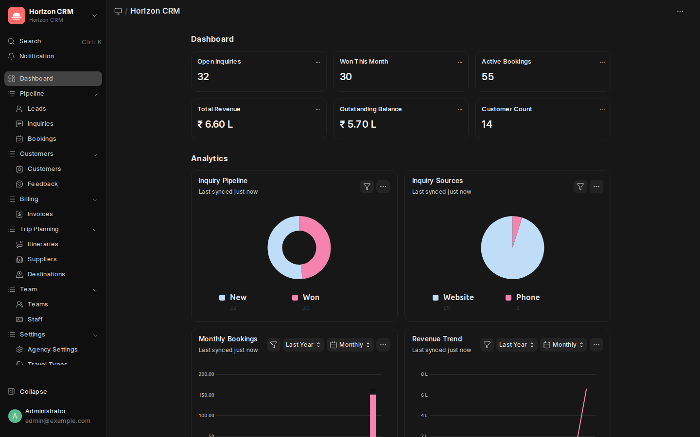

# Horizon CRM — Agency Admin Guide

> **Audience**: Travel agency owners and managers who administer their agency's Horizon CRM site.

---

## Table of Contents

1. [Welcome & Overview](#1-welcome--overview)
2. [First Login & Setup](#2-first-login--setup)
3. [Dashboard Overview](#3-dashboard-overview)
4. [Agency Settings](#4-agency-settings)
5. [Managing Your Team](#5-managing-your-team)
6. [Configuring Destinations & Travel Types](#6-configuring-destinations--travel-types)
7. [Managing Suppliers](#7-managing-suppliers)
8. [Monitoring Inquiries & Bookings](#8-monitoring-inquiries--bookings)
9. [Invoice & Revenue Tracking](#9-invoice--revenue-tracking)
10. [Kanban Boards](#10-kanban-boards)
11. [Reports & Analytics](#11-reports--analytics)
12. [Customer Feedback Review](#12-customer-feedback-review)
13. [User Roles & Permissions](#13-user-roles--permissions)
14. [Theme & Personalization](#14-theme--personalization)
15. [Best Practices](#15-best-practices)

---

## 1. Welcome & Overview

As an **Agency Admin**, you are the primary manager of your travel agency's Horizon CRM instance. Your responsibilities include:

- Setting up and configuring the agency
- Adding and managing staff members
- Overseeing all inquiries, bookings, and revenue
- Reviewing customer feedback
- Configuring destinations, suppliers, and travel types

### What You'll See After Login


The sidebar navigation gives you access to all features, organized into logical sections:

| Section | What's Inside |
|---------|---------------|
| **Pipeline** | Leads, Inquiries, Bookings — your sales funnel |
| **Customers** | Customer profiles and post-travel feedback |
| **Billing** | Invoice management and payment tracking |
| **Trip Planning** | Itineraries, suppliers, and destinations |
| **Team** | Staff and team management |
| **Settings** | Agency configuration and customization |

---

## 2. First Login & Setup

### Step 1: Log In

1. Open your browser and navigate to your agency URL (e.g., `https://youragency.example.com`)
2. Enter your **email** and **password** provided by the System Administrator
3. Click **Login**

### Step 2: Configure Your Agency

Navigate to **Settings → Agency Settings** in the sidebar:

1. **Agency Name**: Enter your agency's display name (e.g., "Wanderlust Travels")
2. **Agency Code**: A short unique code (e.g., "WLT")
3. **Contact Email**: Your agency's primary email
4. **Phone**: Business phone number
5. **Website**: Your agency's website URL
6. **Address**: Physical office address
7. **Logo**: Upload your agency logo
8. Click **Save**

### Step 3: Add Travel Types

Navigate to **Settings → Travel Types**:

Common travel types to add:
- Adventure
- Beach / Resort
- Business
- Cultural / Heritage
- Family
- Group Tour
- Honeymoon
- Solo Travel
- Luxury
- Pilgrimage

### Step 4: Add Destinations

Navigate to **Trip Planning → Destinations**:

For each destination, fill in:
- **Destination Name**: e.g., "Bali, Indonesia"
- **Country**: e.g., "Indonesia"
- **Region**: e.g., "Southeast Asia"
- **Description**: Brief description
- **Image**: Upload a destination photo
- **Is Popular**: Check if it's a frequently requested destination

### Step 5: Add Suppliers

Navigate to **Trip Planning → Suppliers**:

Add your key partners:
- Hotels and resorts
- Airlines
- Local tour operators
- Transportation companies
- Activity providers

---

## 3. Dashboard Overview

The Horizon CRM dashboard provides a real-time overview of your agency's performance.


### Number Cards (Top Row)

| Card | Description |
|------|-------------|
| **Open Inquiries** | Number of active inquiries that need attention |
| **Won This Month** | Inquiries converted to bookings this month |
| **Active Bookings** | Total bookings currently in progress |
| **Total Revenue** | Cumulative revenue from all confirmed bookings |
| **Outstanding Balance** | Total unpaid amounts across all bookings |
| **Customer Count** | Total registered customers |

### Analytics Charts

- **Inquiry Pipeline**: Donut chart showing inquiry distribution by status (New, Contacted, Quoted, Won, Lost)
- **Inquiry Sources**: Breakdown of how inquiries arrive (Website, Phone, Walk-in, Referral)
- **Monthly Bookings**: Bar chart of bookings over time
- **Revenue Trend**: Line chart showing revenue growth

### Using the Dashboard

- Click **"..."** on any card to view its filters or go to the full report
- Charts auto-refresh. Click the refresh icon to update manually
- Click on chart segments to drill down into specific data

---

## 4. Agency Settings

The **Agency Settings** page (`Settings → Agency Settings`) is a singleton DocType — there's only one per site.

### Fields

| Field | Description |
|-------|-------------|
| Agency Name | Your business name, displayed in headers and invoices |
| Agency Code | Short code used in auto-naming (e.g., INQ-WLT-00001) |
| Logo | Agency logo for branding |
| Contact Email | Primary business email |
| Phone | Business phone |
| Website | Your agency website |
| Address | Physical address |
| Status | Active or Inactive |
| Admin User | Primary admin user for this agency |
| Subscription Plan | Free / Basic / Premium tier |
| Max Staff | Maximum number of staff members allowed |

### Saving Changes

After making changes, click the **Save** button. Some fields (like Agency Code) may affect document naming patterns.

---

## 5. Managing Your Team

### Adding Staff Members

1. Navigate to **Team → Staff** in the sidebar
2. Click **+ Add Travel Agency Staff**
3. Fill in:
   - **Staff User**: Link to an existing user account (or create one first)
   - **Role in Agency**: Select "Agency Admin", "Team Lead", or "Staff"
   - **Team**: Assign to a team (optional)
   - **Designation**: Job title (e.g., "Senior Travel Consultant")
   - **Phone**: Direct contact number
4. Check **Is Active** to enable the account
5. Click **Save**

### Creating Teams

1. Navigate to **Team → Teams** in the sidebar
2. Click **+ Add Travel Team**
3. Fill in:
   - **Team Name**: e.g., "Domestic Team", "International Team"
   - **Team Lead**: Select a staff member as the lead
   - **Description**: Brief team description
4. Click **Save**

### Role Capabilities

| Capability | Agency Admin | Team Lead | Staff |
|-----------|:------:|:-------:|:---:|
| View all inquiries | ✅ | ✅ (team) | Own only |
| Create inquiries | ✅ | ✅ | ✅ |
| Create bookings | ✅ | ✅ | ✅ |
| View all bookings | ✅ | ✅ (team) | Own only |
| Manage invoices | ✅ | ✅ | View only |
| Add/edit staff | ✅ | ❌ | ❌ |
| Agency settings | ✅ | ❌ | ❌ |
| View reports | ✅ | ✅ | Limited |
| Manage suppliers | ✅ | ✅ | View only |
| Manage destinations | ✅ | ✅ | View only |

---

## 6. Configuring Destinations & Travel Types

### Travel Types

Travel Types categorize inquiries and bookings. Navigate to **Settings → Travel Types**.

Each travel type has:
- **Type Name**: Display name (e.g., "Adventure")
- **Description**: Brief description of this travel category
- **Icon**: Optional icon for visual identification

### Destinations

Destinations are the places your agency offers trips to. Navigate to **Trip Planning → Destinations**.

**Tips for managing destinations:**
- Mark popular destinations with **Is Popular** for quick filtering
- Upload attractive photos — these appear in list views
- Use the **Region** field for grouping (e.g., "Europe", "Southeast Asia")
- Add detailed descriptions to help staff answer customer questions

---

## 7. Managing Suppliers

Navigate to **Trip Planning → Suppliers** to manage your travel partners.

### Supplier Types

| Type | Examples |
|------|----------|
| Hotel | Resorts, boutique hotels, hostels |
| Airline | Commercial airlines, charter services |
| Tour Operator | Local guides, activity providers |
| Transport | Car rentals, bus services, boat operators |
| Other | Insurance providers, visa services |

### Adding a Supplier

Suppliers are organized into six category-specific DocTypes:

| DocType | Prefix | Use Case |
|---------|--------|----------|
| Airline Supplier | AIR- | Commercial airlines, charter services |
| Hotel Supplier | HTL- | Resorts, boutique hotels, hostels |
| Visa Agent | VISA- | Visa processing services |
| Transport Supplier | TRN- | Car rentals, bus services, boat operators |
| Tour Operator | TOUR- | Local guides, activity providers |
| Insurance Provider | INS- | Travel insurance providers |

1. Navigate to the relevant supplier DocType (e.g., **Airline Supplier**)
2. Click **+ Add** and fill in the category-specific fields
3. Add **Services** in the child table:
   - **Service Name**: e.g., "Deluxe Room - Peak Season"
   - **Description**: Detailed service description
   - **Price**: Standard rate
4. Click **Save**

### Supplier Best Practices

- Keep supplier contact info up to date
- Add multiple services per supplier with current pricing
- Note seasonal price variations in descriptions
- Regularly review and deactivate suppliers you no longer use

---

## 8. Monitoring Inquiries & Bookings

As an Agency Admin, you have visibility into all inquiries and bookings.

### Inquiry Pipeline


Navigate to **Pipeline → Inquiries** to see all inquiries.

**Status Pipeline:**
```
New → Contacted → Quoted → Won → Lost
```

| Status | Meaning |
|--------|---------|
| **New** | Fresh inquiry, not yet contacted |
| **Contacted** | Staff has reached out to the customer |
| **Quoted** | A price quote / itinerary has been sent |
| **Won** | Customer accepted — ready to become a booking |
| **Lost** | Customer declined or inquiry expired |

### Filtering & Sorting

Use the filter bar at the top to:
- Filter by **Status** to see only open or won inquiries
- Filter by **Assigned To** to see a specific agent's pipeline
- Filter by **Destination** to check demand for a location
- Sort by **Created On** to see newest first

### Booking Overview


Navigate to **Pipeline → Bookings** to see all bookings.

**Booking Status Flow:**
```
Confirmed → In Progress → Completed → Cancelled
```

### Quick Actions

- Click any inquiry/booking to open its detail view
- Use the **Actions** dropdown for status changes
- Click **Communication** to view message history

---

## 9. Invoice & Revenue Tracking

### Invoice List


Navigate to **Billing → Invoices** to manage all invoices.

### Creating an Invoice

1. Open a **Booking** record
2. Click **Actions → Create Invoice** (or navigate to Invoices and create manually)
3. Fill in:
   - **Customer**: Auto-linked from the booking
   - **Booking**: Link to the source booking
   - **Amount**: Total invoice amount
   - **Due Date**: Payment deadline
4. Click **Save** then **Submit**

### Tracking Payments

Within each booking, the **Payments** child table tracks:
- **Payment Amount**
- **Payment Date**
- **Payment Method** (Bank Transfer, Credit Card, Cash, etc.)
- **Payment Status** (Pending, Received, Refunded)
- **Reference Number**

### Revenue Dashboard

The dashboard number cards show:
- **Total Revenue**: Sum of all received payments
- **Outstanding Balance**: Total unpaid invoice amounts

---

## 10. Kanban Boards

Kanban boards provide a visual drag-and-drop interface for managing your pipeline.

### Accessing Kanban

Navigate to **Settings → Kanban Boards** or from any list view, switch to **Kanban View** using the view selector in the top-right.

### Default Kanban Board: Lead Pipeline

The pre-configured **Lead Pipeline** board shows leads organized by status:
- Columns: New | Contacted | Qualified | Converted | Lost

### Using Kanban

- **Drag & drop** cards between columns to change status
- Click a card to open the full record
- Use the **+ Add** button at the top of a column to create new records
- Cards show key information at a glance (customer name, destination, date)

---

## 11. Reports & Analytics

### Dashboard Charts

The main dashboard provides four key analytics:

1. **Inquiry Pipeline** (Donut): Visual breakdown of inquiry statuses
2. **Inquiry Sources** (Pie): Where your inquiries come from
3. **Monthly Bookings** (Bar): Booking volume trends
4. **Revenue Trend** (Line): Revenue over time

### Custom Reports

Frappe's built-in **Report Builder** lets you create custom reports:

1. Go to the search bar (Ctrl+K) and type "Query Report" or "Report Builder"
2. Select a DocType (e.g., Travel Booking)
3. Add columns and filters
4. Save as a custom report for your team

### Key Metrics to Monitor

| Metric | What to Watch |
|--------|---------------|
| Inquiry-to-Booking Rate | Are you converting inquiries effectively? |
| Average Revenue per Booking | Is your average deal size growing? |
| Outstanding Balance | Are payments coming in on time? |
| Inquiry Response Time | How fast is your team responding? |
| Customer Count Growth | Is your customer base expanding? |
| Inquiry Sources | Where should you invest marketing? |

---

## 12. Customer Feedback Review

Navigate to **Customers → Feedback** to review post-travel feedback.

### Feedback Fields

| Field | Description |
|-------|-------------|
| Customer | Who provided the feedback |
| Booking | Which booking it relates to |
| Rating | 1-5 star rating |
| Comments | Written feedback from the customer |
| Date | When feedback was submitted |

### Acting on Feedback

- **5 Stars**: Thank the customer, ask for a testimonial
- **4 Stars**: Note what could improve
- **3 Stars or below**: Follow up personally, create action items
- Use feedback trends to improve your service quality

---

## 13. User Roles & Permissions

### Built-in Roles

| Role | Description |
|------|-------------|
| **System Manager** | Full system access (typically only System Admin) |
| **Agency Admin** | Full access within the agency (staff, settings, all data) |
| **Team Lead** | Access to team data, can assign inquiries |
| **Staff** | Access to own assigned records |

### Creating User Accounts

1. Navigate to **User** (use Ctrl+K search bar, type "User")
2. Click **+ Add User**
3. Fill in email, first name, last name
4. Assign roles: Enable the appropriate role (e.g., "Staff")
5. Click **Save** — the user receives an activation email

### Permission Rules

- **Agency Admin**: Read/Write/Create/Delete on most DocTypes
- **Team Lead**: Read/Write/Create on operational DocTypes; Read on team members' records
- **Staff**: Read/Write/Create on own records; Read on shared resources (Destinations, Suppliers)

---

## 14. Theme & Personalization

### Switching Themes

Horizon CRM supports **Light** and **Dark** themes:

1. Click your avatar/name in the bottom-left sidebar
2. Go to **Settings** (or **My Settings**)
3. Under **Desktop Settings**, change the **Theme** to "Light" or "Dark"
4. The change applies immediately

| Light Theme | Dark Theme |
|-------------|------------|
|  |  |

### Sidebar Customization

The sidebar sections and links are pre-configured for the optimal workflow. If you need to customize:

1. Press **Ctrl+K** and search for "Workspace"
2. Edit the **Horizon CRM** workspace
3. Rearrange sections and links as needed

---

## 15. Best Practices

### For New Agencies

1. **Set up completely before going live**: Add all travel types, popular destinations, and active suppliers before your team starts using the system
2. **Train your team**: Walk each staff member through the inquiry-to-booking workflow
3. **Start with Team Leads**: Get your team leads comfortable first, then roll out to all staff

### For Daily Operations

1. **Check the dashboard every morning**: Review open inquiries and active bookings
2. **Assign inquiries quickly**: Don't let new inquiries sit unassigned
3. **Update statuses promptly**: Move inquiries through the pipeline as they progress
4. **Record all payments**: Keep financial records accurate and up to date

### For Growth

1. **Review analytics weekly**: Look for trends in inquiry sources and conversion rates
2. **Act on feedback**: Low ratings are opportunities to improve
3. **Keep supplier info current**: Outdated pricing leads to customer issues
4. **Add new destinations**: Expand your offerings based on customer demand

### Data Quality

1. **Complete all required fields** when creating records
2. **Use the Customer link** on inquiries — don't just type names
3. **Attach itineraries to bookings** so customers can access them via the portal
4. **Record feedback** for every completed booking
