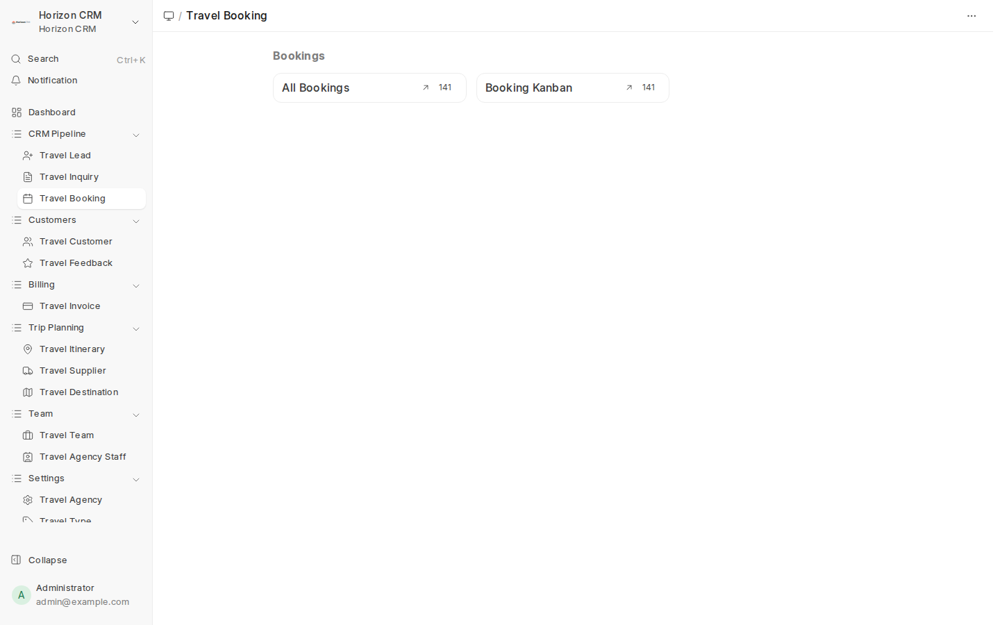
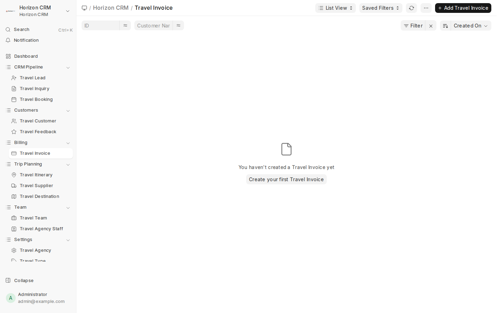
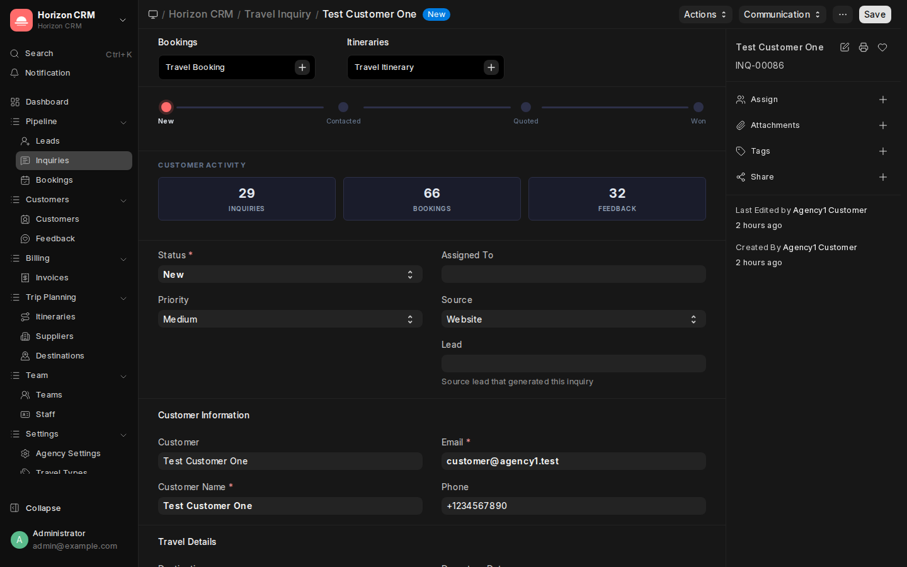

# Horizon CRM — Staff User Guide

> **Audience**: Travel agents, team leads, and front-line staff who handle daily operations in Horizon CRM.

---

## Table of Contents

1. [Getting Started](#1-getting-started)
2. [Navigating the Desk](#2-navigating-the-desk)
3. [Managing Leads](#3-managing-leads)
4. [Handling Inquiries](#4-handling-inquiries)
5. [Creating Itineraries](#5-creating-itineraries)
6. [Managing Bookings](#6-managing-bookings)
7. [Working with Customers](#7-working-with-customers)
8. [Invoice & Payment Tracking](#8-invoice--payment-tracking)
9. [Using Kanban Boards](#9-using-kanban-boards)
10. [Suppliers & Destinations](#10-suppliers--destinations)
11. [Communication & Notes](#11-communication--notes)
12. [Daily Workflow Checklist](#12-daily-workflow-checklist)
13. [Keyboard Shortcuts](#13-keyboard-shortcuts)
14. [Tips & Tricks](#14-tips--tricks)
15. [FAQ](#15-faq)

---

## 1. Getting Started

### Logging In

1. Open your browser and go to your agency's Horizon CRM URL
2. Enter your **Email** and **Password**
3. Click **Login**

> **Tip**: Bookmark the URL for quick access. Use a password manager to store credentials securely.

### What You'll See

After login, you'll see the Horizon CRM dashboard with the sidebar on the left:


### Your Role

As a **Staff** member (Travel Agent), you can:
- Create and manage leads and inquiries assigned to you
- Build itineraries for customer trips
- Create and manage bookings
- Track payments and invoices
- View customer information
- Access suppliers and destination details

---

## 2. Navigating the Desk

### Sidebar Navigation

The left sidebar is your main navigation tool. Here's what each section contains:

| Section | Items | Your Daily Use |
|---------|-------|---------------|
| **Pipeline** | Leads, Inquiries, Bookings | Where you spend most of your time |
| **Customers** | Customers, Feedback | Look up customer details, review feedback |
| **Billing** | Invoices | Check payment status |
| **Trip Planning** | Itineraries, Suppliers, Destinations | Plan trips and look up partners |
| **Team** | Teams, Staff | View team info |
| **Settings** | Agency Settings, Travel Types, Kanban Boards | Reference lookups |

### Key Interface Elements

- **Search Bar** (`Ctrl+K`): Quick search for any record — type a customer name, inquiry number, or booking ID
- **Breadcrumb**: Shows your current location (e.g., Horizon CRM / Travel Inquiry / INQ-00086)
- **Actions Button**: Top-right dropdown for record-specific actions
- **Communication Button**: Send emails and log communications
- **Save Button**: Save changes to the current record

### List Views vs. Form Views

- **List View**: Shows all records of a type (e.g., all inquiries). Use filters, sorting, and column selection.
- **Form View**: Opens a single record for viewing/editing. This is where you work with individual inquiries, bookings, etc.

---

## 3. Managing Leads

Leads are potential customers who haven't made a formal inquiry yet.

### Creating a Lead

1. Navigate to **Pipeline → Leads** in the sidebar
2. Click **+ Add Travel Lead**
3. Fill in:
   - **Full Name**: Lead's name
   - **Email**: Contact email
   - **Phone**: Contact phone
   - **Source**: How you found this lead (Website, Phone, Walk-in, Referral)
   - **Status**: Starts as "New"
4. Click **Save**

### Lead Status Pipeline

```
New → Contacted → Qualified → Converted → Lost
```

| Status | Action |
|--------|--------|
| **New** | Fresh lead — reach out within 24 hours |
| **Contacted** | You've made first contact |
| **Qualified** | Lead is interested and has a real travel need |
| **Converted** | Lead has made an inquiry → create an Inquiry record |
| **Lost** | Lead is not interested or unresponsive |

### Converting a Lead to an Inquiry

When a lead is qualified and makes a formal request:

1. Open the lead record
2. Change status to **Converted**
3. Navigate to **Pipeline → Inquiries**
4. Click **+ Add Travel Inquiry**
5. Fill in the customer details (can copy from the lead)
6. Link the **Lead** field to the original lead record

---

## 4. Handling Inquiries

Inquiries are the heart of your daily work. Each inquiry represents a customer's travel request.

### The Inquiry Form


### Creating an Inquiry

1. Navigate to **Pipeline → Inquiries**
2. Click **+ Add Travel Inquiry**
3. Fill in the sections:

**Customer Information:**
- **Customer**: Link to an existing customer (or create new)
- **Customer Name**: Auto-fills from customer link
- **Email** and **Phone**: Contact details

**Travel Details:**
- **Destination**: Select from your configured destinations
- **Travel Type**: Adventure, Beach, Business, etc.
- **Departure Date** and **Return Date**: Travel dates
- **Number of Travelers**: Party size
- **Budget Range**: Customer's budget (helps with itinerary planning)
- **Special Requirements**: Dietary needs, accessibility, preferences

**Pipeline Information:**
- **Status**: Starts as "New"
- **Priority**: Low, Medium, High, Urgent
- **Source**: Where the inquiry came from
- **Assigned To**: Who will handle this inquiry (may be auto-assigned)

4. Click **Save**

### Working Through the Pipeline

**Step 1: Contact the Customer**
- Change status from **New** to **Contacted**
- Add a note or email via the Communication button
- Confirm their travel requirements

**Step 2: Create an Itinerary**
- Build a day-by-day itinerary (see Section 5)
- Share with the customer for review

**Step 3: Send a Quote**
- Change status to **Quoted**
- Include pricing based on itinerary costs
- Set a follow-up reminder

**Step 4: Close the Inquiry**
- If accepted → Change to **Won** → Create a Booking
- If declined → Change to **Lost** → Note the reason

### Customer Activity Cards

At the top of each inquiry form, you'll see **Customer Activity** cards showing:
- **Inquiries**: Total inquiries from this customer
- **Bookings**: Total bookings
- **Feedback**: Feedback entries

These help you understand the customer's history at a glance.

### The Status Progress Bar

The colored dots at the top of the form show where the inquiry is in the pipeline:

```
🔴 New → ⚪ Contacted → ⚪ Quoted → ⚪ Won
```

The active stage is highlighted. Click on a stage to quickly change the status.

---

## 5. Creating Itineraries

Itineraries are day-by-day travel plans you create for customers.

### Creating an Itinerary

1. Navigate to **Trip Planning → Itineraries**
2. Click **+ Add Travel Itinerary**
3. Fill in:
   - **Itinerary Name**: e.g., "7-Day Bali Adventure"
   - **Inquiry**: Link to the related inquiry
   - **Start Date** and **End Date**: Travel dates
4. Add **Day Items** in the child table:

| Field | Example |
|-------|---------|
| **Day Number** | 1 |
| **Activity** | Airport pickup, check-in at resort |
| **Accommodation** | Sunset Beach Resort (Deluxe Room) |
| **Transport** | Private airport transfer |
| **Notes** | Welcome dinner included |
| **Cost** | ₹15,000 |

5. Add a row for each day of the trip
6. Click **Save**

### Itinerary Tips

- **Be specific**: Include timings, meeting points, and contact numbers
- **Include alternatives**: Note backup plans for weather-dependent activities
- **Price accurately**: Use supplier rates from the Suppliers module
- **Attach to booking**: Once confirmed, link the itinerary to the booking

### Quick Create from Inquiry

From an open Inquiry form, you may see a quick-create link for **Travel Itinerary** in the connections section at the top of the form. This auto-fills the inquiry link and dates.

---

## 6. Managing Bookings

Bookings are confirmed travel arrangements with financial details.

### Creating a Booking



1. Navigate to **Pipeline → Bookings**
2. Click **+ Add Travel Booking**
3. Fill in:

**Booking Details:**
- **Inquiry**: Link to the source inquiry (auto-fills customer info)
- **Customer**: Customer making the booking
- **Departure Date** and **Return Date**
- **Destination**: Travel destination
- **Status**: Starts as "Confirmed"

**Financial Details:**
- **Total Amount**: Total cost of the trip
- **Paid Amount**: Calculated from payments
- **Balance**: Auto-calculated (Total - Paid)

**Payments (Child Table):**
- Click **Add Row** to record each payment
- **Amount**: Payment amount
- **Date**: When payment was received
- **Method**: Bank Transfer, Credit Card, Cash, UPI, etc.
- **Status**: Pending, Received, Refunded
- **Reference**: Transaction reference number

4. Click **Save**

### Booking Status Flow

```
Confirmed → In Progress → Completed → Cancelled
```

| Status | When to Use |
|--------|-------------|
| **Confirmed** | Customer has confirmed and initial payment received |
| **In Progress** | Travel is underway |
| **Completed** | Travel is done, all services delivered |
| **Cancelled** | Customer cancelled (note: handle refunds) |

### Linking Everything Together

A complete booking should have:
- ✅ Linked **Inquiry** (source of the booking)
- ✅ Linked **Customer** (who is traveling)
- ✅ Linked **Itinerary** (the day-by-day plan)
- ✅ **Payments** recorded in the child table
- ✅ **Invoice** created for billing

---

## 7. Working with Customers

### Customer List


Navigate to **Customers → Customers** to see all customers.

### Customer Form


### Creating a Customer

1. Click **+ Add Travel Customer**
2. Fill in:
   - **Customer Name**: Full name
   - **Email**: Primary email (used for portal login)
   - **Phone**: Contact number
   - **Address**: Mailing address
   - **Nationality**: Customer's nationality
   - **Passport Number**: For international travel
   - **Preferences**: Travel preferences and notes (e.g., "prefers window seats, vegetarian")
   - **Portal User**: Link to a User account for portal access
3. Click **Save**

### Customer History

From a customer's profile, you can quickly access:
- All their inquiries
- All their bookings
- Feedback they've provided

Use the **Links** section in the sidebar of the form to see related records.

---

## 8. Invoice & Payment Tracking

### Viewing Invoices



Navigate to **Billing → Invoices** to see all invoices.

### Creating an Invoice

1. Click **+ Add Travel Invoice**
2. Fill in:
   - **Customer**: Who to bill
   - **Booking**: Related booking
   - **Invoice Amount**: Total amount
   - **Due Date**: Payment deadline
   - **Description**: What the invoice covers
3. Click **Save**

### Payment Status

Track payment progress on the booking form's Payments child table. The booking automatically calculates:
- **Total Amount**: The agreed price
- **Paid Amount**: Sum of received payments
- **Balance**: What's still owed

> **Tip**: Always record payments immediately when received. This keeps the dashboard numbers accurate.

---

## 9. Using Kanban Boards

Kanban boards give you a visual, drag-and-drop view of your pipeline.

### Switching to Kanban View

1. Go to any list view (e.g., Inquiries)
2. Click **List View** dropdown in the top-right
3. Select **Kanban** view
4. Choose a board (e.g., "Lead Pipeline")

### Working with Kanban

- **Drag** cards between columns to change their status
- **Click** a card to open the full record
- Cards show key details: customer name, destination, date
- Columns represent status stages (New, Contacted, Quoted, Won, Lost)

### When to Use Kanban

- **Morning review**: Quickly scan all your open inquiries
- **Pipeline meetings**: Share screen during team standups
- **Bulk status updates**: Drag multiple cards to update after a busy day

---

## 10. Suppliers & Destinations

### Looking Up Suppliers

Navigate to **Trip Planning → Suppliers** when planning itineraries:

- Search by name, type, or location
- Check service details and current pricing
- Note contact information for booking confirmations

### Browsing Destinations

Navigate to **Trip Planning → Destinations** for reference:

- View popular destinations (filtered by "Is Popular" flag)
- Check descriptions for customer-facing information
- Note regions for grouping similar destinations

> **Note**: If you need to add or modify suppliers/destinations, ask your Agency Admin. Staff typically have read-only access to these records.

---

## 11. Communication & Notes

### Adding Comments

On any form (Inquiry, Booking, Customer), scroll to the **Comment Box** at the bottom:

1. Type your note or update
2. Click **Comment** or press `Ctrl+Enter`
3. The comment is timestamped and attributed to you

### Email Communication

1. Open the record (e.g., an Inquiry)
2. Click the **Communication** button in the top-right
3. Compose your email
4. The email is logged in the record's timeline

### Using @Mentions

In comments, type `@` followed by a colleague's name to notify them. They'll receive an in-app notification.

### Activity Timeline

Each record maintains a full activity timeline showing:
- Status changes
- Field updates
- Comments
- Emails sent/received
- Assignments

---

## 12. Daily Workflow Checklist

Use this checklist to start each workday:

### Morning (9:00 AM)

- [ ] **Check Dashboard**: Review open inquiries, won this month, active bookings
- [ ] **Review New Inquiries**: Check for overnight inquiries assigned to you
- [ ] **Check Follow-ups**: Look at inquiries in "Contacted" or "Quoted" status that need follow-up
- [ ] **Team Standup**: Review Kanban board with team lead

### During the Day

- [ ] **Respond to new inquiries** within 2 hours
- [ ] **Update inquiry statuses** as you make progress
- [ ] **Create itineraries** for quoted inquiries
- [ ] **Record payments** immediately when received
- [ ] **Add comments** to records as you work (for your trail)

### End of Day (5:30 PM)

- [ ] **Update all statuses**: Make sure every record reflects current state
- [ ] **Check for urgent items**: Any inquiries that need response by tomorrow
- [ ] **Review tomorrow**: Quick look at scheduled departures and follow-ups

---

## 13. Keyboard Shortcuts

| Shortcut | Action |
|----------|--------|
| `Ctrl+K` | Open search bar (search anything) |
| `Ctrl+S` | Save the current record |
| `Ctrl+Enter` | Post a comment |
| `Ctrl+E` | Edit the current record |
| `Esc` | Close dialog / cancel editing |
| `Ctrl+Shift+R` | Hard refresh the page |

### Navigation Shortcuts

| Shortcut | Action |
|----------|--------|
| `Alt+S` | Open sidebar |
| Search → type name | Jump to any DocType, record, or page |

---

## 14. Tips & Tricks

### Speed Tips

1. **Use Ctrl+K religiously**: The search bar is the fastest way to navigate. Type "INQ-00086" to jump directly to that inquiry.
2. **Bookmark frequent pages**: Keep your inquiry list and booking list bookmarked.
3. **Use List View filters**: Save commonly-used filter combinations as "Saved Filters".

### Data Quality Tips

1. **Always link the Customer**: Don't just type the name — use the Customer link field. This builds their history.
2. **Record the Source**: Knowing how inquiries arrive helps your admin understand marketing effectiveness.
3. **Be specific in notes**: Instead of "Discussed trip", write "Customer prefers 5-star hotels, flexible on dates, budget ₹2L for 2 people".

### Pipeline Management Tips

1. **Don't hoard inquiries**: If you can't follow up within 48 hours, ask your team lead to reassign.
2. **Move to Lost quickly**: A dead inquiry in "New" status hurts your metrics. Mark it Lost and move on.
3. **Follow up on Quoted**: Set reminders for inquiries in "Quoted" status — the customer may need a gentle nudge.

### Dark Theme

If you work long hours, try the dark theme — it's easier on the eyes:



Switch it from your user settings (click your avatar in the bottom-left sidebar).

---

## 15. FAQ

### Q: I created an inquiry but it doesn't show on my dashboard?
**A**: Make sure the inquiry's **Assigned To** field is set to your username. Unassigned inquiries may only appear for Agency Admins.

### Q: How do I convert an inquiry to a booking?
**A**: Change the inquiry status to **Won**, then create a new Booking and link it to the inquiry via the **Inquiry** field.

### Q: Can I delete a record I created by mistake?
**A**: Staff typically cannot delete records. Ask your Agency Admin to delete it, or change the status to indicate it's invalid.

### Q: How do I see only my assigned inquiries?
**A**: In the Inquiry list view, add a filter: **Assigned To = [your email]**. Save this as a Saved Filter for quick access.

### Q: How do I attach a document (PDF, image) to an inquiry?
**A**: Open the inquiry form, look for the **Attachments** section in the right sidebar, click **+** to upload files.

### Q: The dashboard numbers seem wrong. What should I do?
**A**: Click the **...** menu on the number card and check its filters. The numbers are live calculations based on the data in the system.

### Q: I get an error when saving. What should I do?
**A**: Check for required fields (marked with a red asterisk *). If all fields are filled, try refreshing the page (Ctrl+Shift+R) and saving again. If the issue persists, contact your Agency Admin.
