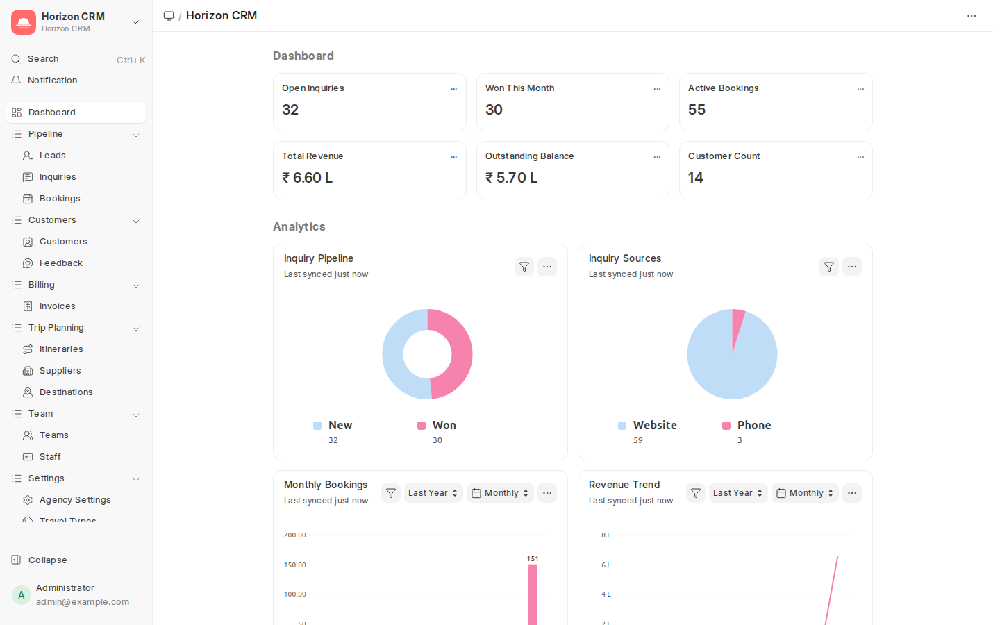
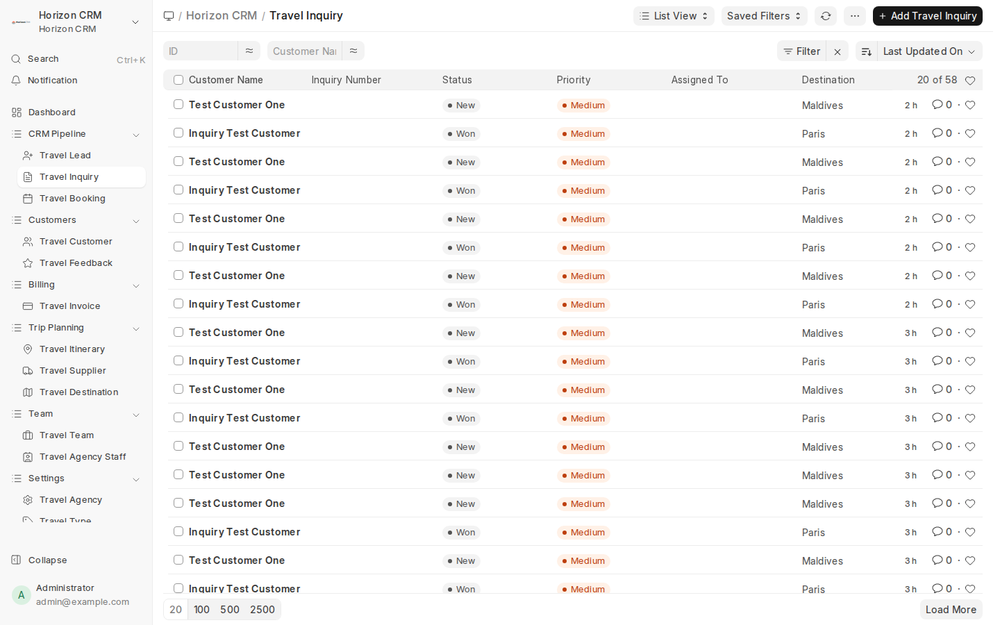
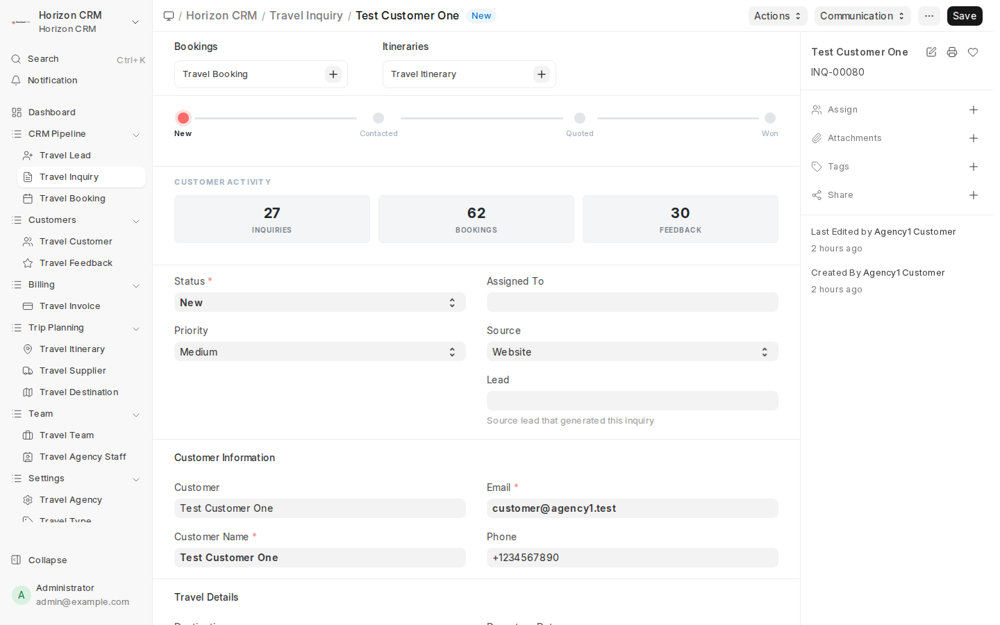
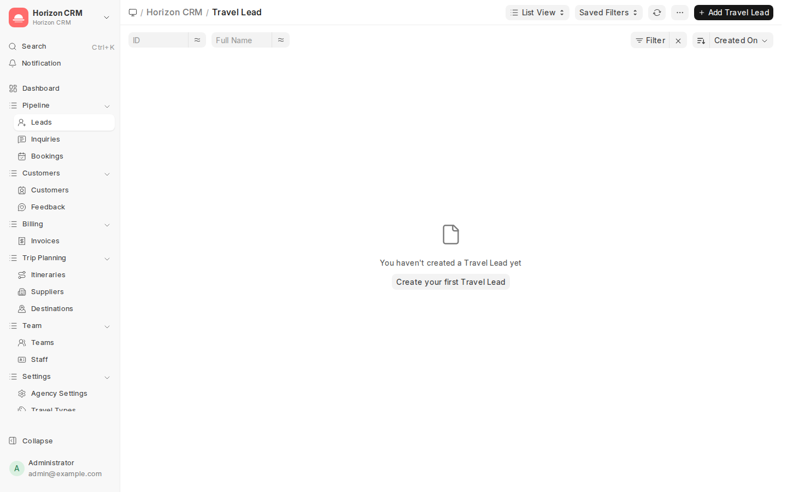
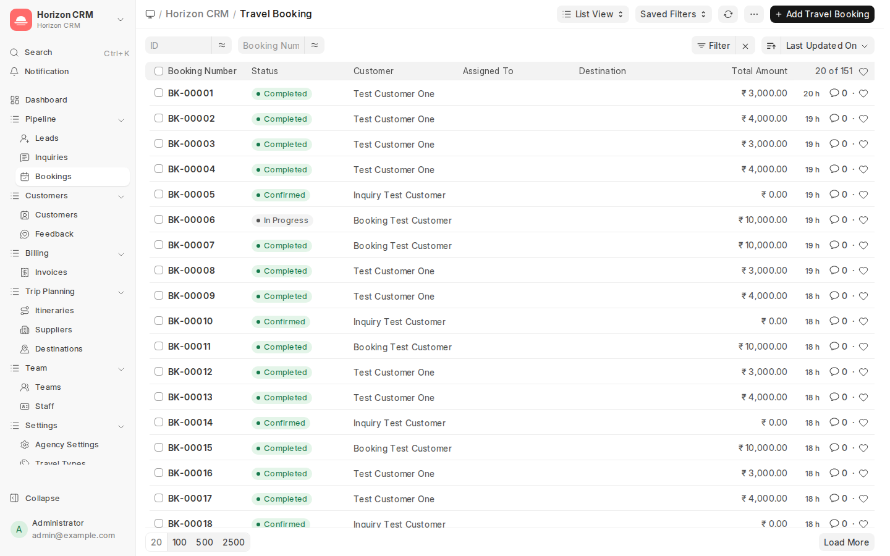
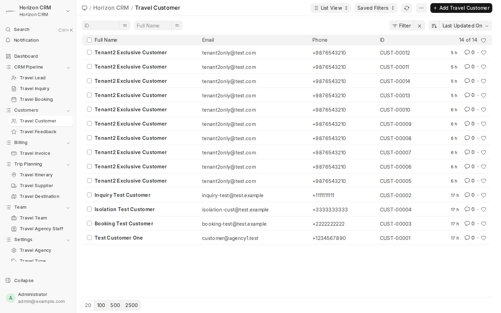
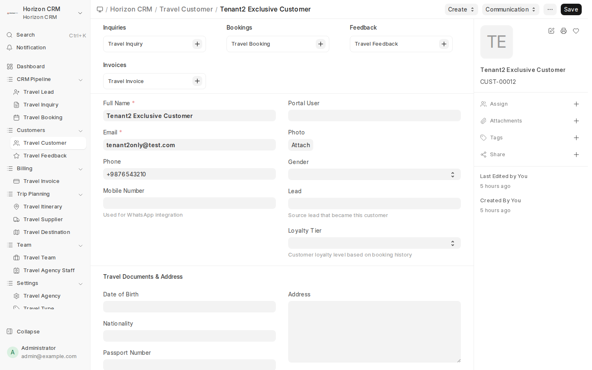

# Horizon CRM — Complete User Guide

> **Horizon CRM** is a multi-tenant Travel Agency CRM built on the Frappe Framework.

---

## Table of Contents

1. [Docker Setup & First Launch](#1-docker-setup--first-launch)
2. [Creating a New Tenant](#2-creating-a-new-tenant)
3. [Logging In & Navigating the Desk](#3-logging-in--navigating-the-desk)
4. [Workspace Dashboard](#4-workspace-dashboard)
5. [Managing Inquiries](#5-managing-inquiries)
6. [Working with Kanban Boards](#6-working-with-kanban-boards)
7. [Creating Bookings & Payments](#7-creating-bookings--payments)
8. [Managing Customers](#8-managing-customers)
9. [Itineraries & Day Plans](#9-itineraries--day-plans)
10. [Suppliers & Services](#10-suppliers--services)
11. [Teams & Staff Assignment](#11-teams--staff-assignment)
12. [Customer Portal](#12-customer-portal)
13. [User Roles & Permissions](#13-user-roles--permissions)
14. [CLI Commands Reference](#14-cli-commands-reference)
15. [Troubleshooting](#15-troubleshooting)

---

## 1. Docker Setup & First Launch

### Prerequisites
- Docker & Docker Compose installed
- Git

### Start Services

```bash
# Clone the repository
git clone <repo-url> frappe_space
cd frappe_space

# Start MariaDB and Redis containers
docker compose up -d mariadb redis-cache redis-queue

# Wait for MariaDB to be healthy
docker compose ps   # Ensure mariadb shows "healthy"
```

### Initialize Bench (first time only)

```bash
cd bench0

# Create a Python virtual environment
python3 -m venv env
source env/bin/activate

# Install Frappe framework
pip install -e apps/frappe

# Initialize bench configuration
bench setup env
bench build
```

### Create the Default Site

```bash
# Create the first site (default tenant)
bench new-site horizon.localhost \
    --db-root-password 123 \
    --admin-password admin \
    --mariadb-root-username root

# Install the app
bench --site horizon.localhost install-app horizon_crm

# Start the development server
bench start
```

The app is now accessible at **http://horizon.localhost:8000**

---

## 2. Creating a New Tenant

Each tenant is a separate Frappe site with its own database, users, and data.

### Step 1: Create a New Site

```bash
bench new-site tenant2.localhost \
    --db-root-password 123 \
    --admin-password admin

bench --site tenant2.localhost install-app horizon_crm
```

### Step 2: Configure the Tenant

```bash
bench --site tenant2.localhost horizon-crm create-tenant \
    --agency-name "Acme Travel" \
    --admin-email admin@acmetravel.com \
    --admin-password SecurePass123 \
    --max-staff 20
```

This command:
- Creates the admin user with the `Agency Admin` role
- Configures the Travel Agency singleton (agency name, contact, max staff)
- Sets up all branding (logo, footer, copyright as "Horizon CRM")

### Step 3: Add Site to Hosts File

```bash
# Add to /etc/hosts
echo "127.0.0.1 tenant2.localhost" | sudo tee -a /etc/hosts
```

### Step 4: Configure Multi-Tenancy

```bash
bench setup add-domain tenant2.localhost --site tenant2.localhost
```

### Step 5: Access the Tenant

Navigate to **http://tenant2.localhost:8001** and log in with the admin credentials.

### View Tenant Info

```bash
bench --site tenant2.localhost horizon-crm tenant-info
```

Output:
```
────────────────────────────────────
  Site:       tenant2.localhost
  Agency:     Acme Travel
  Code:       (none)
  Status:     Active
  Admin:      admin@acmetravel.com
  Email:      admin@acmetravel.com
  Staff:      0/20
  Customers:  0
  Inquiries:  0
  Bookings:   0
────────────────────────────────────
```

---

## 3. Logging In & Navigating the Desk

### Login
1. Open your browser and go to `http://horizon.localhost:8000`
2. Enter your email and password
3. Click **Login**

### Desk Layout
The Frappe Desk has three main areas:
- **Navbar** (top): Search bar, notifications, user menu with Horizon CRM logo
- **Sidebar** (left): Organized workspace navigation with collapsible sections
- **Main Content** (center): The active workspace, list views, or forms

### Sidebar Navigation

The Horizon CRM sidebar is organized into logical sections with icons for quick identification:

| Section | Items | Icons |
|---------|-------|-------|
| **Dashboard** | Workspace home | layout-dashboard |
| **Pipeline** | Leads, Inquiries, Bookings | user-round-plus, message-square-text, calendar-check |
| **Customers** | Customers, Feedback | contact-round, message-circle-heart |
| **Billing** | Invoices | receipt |
| **Trip Planning** | Itineraries, Suppliers, Destinations | route, building-2, map-pinned |
| **Team** | Teams, Staff | users-round, id-card |
| **Settings** | Agency Settings, Travel Types, Kanban Boards | settings, tags, columns-3 |

Each section can be collapsed/expanded by clicking the chevron arrow.



### Navigation
- Click **Horizon CRM** in the sidebar to access the main workspace
- Use the **Search Bar** (`Ctrl + K`) to quickly find any document or page
- Click your **avatar** (top right) for user settings, logout

---

## 4. Workspace Dashboard

The Horizon CRM workspace is your command center. It contains:

### Number Cards (KPIs)
- **Total Inquiries** — All Travel Inquiry records
- **New Inquiries** — Inquiries with status "New"
- **Active Bookings** — Bookings with status "Confirmed" or "In Progress"
- **Total Revenue** — Sum of `total_amount` across all bookings

### Dashboard Charts
- **Inquiry Funnel** — Count of inquiries by status (New → Contacted → Quoted → Won → Lost)
- **Monthly Revenue** — Total booking amounts over the last 12 months

### Shortcuts
| Shortcut | View | Description |
|----------|------|-------------|
| Inquiries | List | All travel inquiries |
| Bookings | List | All bookings |
| Customers | List | Customer database |
| Itineraries | List | Itinerary plans |
| Inquiry Kanban | Kanban | Inquiry pipeline board |
| Booking Kanban | Kanban | Booking status board |


---

## 5. Managing Inquiries

### Create a New Inquiry
1. Go to **Horizon CRM → Travel Inquiry** (or click the shortcut)
2. Click **+ Add Travel Inquiry**
3. Fill in the required fields:
   - **Customer** — Select or create a Travel Customer
   - **Travel Type** — Adventure, Beach, Business, Cultural, etc.
   - **Destination** — Select from pre-loaded destinations (Paris, Bali, Dubai…)
   - **Travel Dates** — Start and end dates
   - **Number of Travelers** — Adult and child counts
   - **Budget** — Estimated budget
4. Click **Save**

### Inquiry Pipeline
Each inquiry follows this pipeline:

```
New → Contacted → Quoted → Won/Lost
```

- **New**: Just created, awaiting first contact
- **Contacted**: Agent has reached out to the customer
- **Quoted**: A quotation/proposal has been sent
- **Won**: Customer accepted — convert to a booking
- **Lost**: Customer declined — select a lost reason

### Visual Pipeline
On the inquiry form, a visual pipeline bar shows the current stage with color-coded dots:
- ● Green = completed stages
- ● Coral = current stage
- ● Red = lost stage
- ○ Gray = future stages

### Convert Inquiry to Booking
When an inquiry is marked as **Won**, you can create a booking directly from it by clicking the **Create Booking** action button.

### Track Lost Reasons
If an inquiry is marked as **Lost**, a lost reason section appears. Select from predefined reasons:
- Competitor, Budget Too High, Bad Timing, No Response, Changed Plans, Destination Change, Service Dissatisfaction, Other





---

## 6. Working with Kanban Boards

Kanban boards provide a visual drag-and-drop interface for managing records.

### Access Kanban Views
- From the workspace, click **Inquiry Kanban** or **Booking Kanban** shortcuts
- Or navigate to any list view and switch to Kanban using the view switcher

### Inquiry Pipeline Kanban
Columns represent inquiry statuses:

| Column | Color | Meaning |
|--------|-------|---------|
| New | 🔵 Blue | Fresh inquiries |
| Contacted | 🟠 Orange | Customer contacted |
| Quoted | 🟡 Yellow | Quotation sent |
| Won | 🟢 Green | Deal closed |
| Lost | 🔴 Red | Deal lost |

### Booking Tracker Kanban
Columns represent booking statuses:

| Column | Color | Meaning |
|--------|-------|---------|
| Confirmed | 🟢 Green | Booking confirmed |
| In Progress | 🟠 Orange | Travel ongoing |
| Completed | 🔵 Blue | Travel completed |
| Cancelled | 🔴 Red | Booking cancelled |

### Using Kanban Boards
1. **Drag & drop** cards between columns to change status
2. **Click** a card to open the full record
3. Cards show key details: customer name, status indicator, dates
4. The board auto-saves when you move a card



---

## 7. Creating Bookings & Payments

### Create a Booking
1. Go to **Horizon CRM → Travel Booking**
2. Click **+ Add Travel Booking**
3. Fill in:
   - **Customer** — Link to Travel Customer
   - **Inquiry** — Link to the original Travel Inquiry (optional)
   - **Destination** — Travel destination
   - **Travel Dates** — Departure and return dates
   - **Total Amount** — Full price of the booking
   - **Traveler Details** — Add travelers (name, passport number, etc.)
4. Click **Save**

### Payment Tracking
Each booking has a **Payments** section with a child table of `Booking Payment` entries:

| Field | Description |
|-------|-------------|
| Payment Date | When payment was received |
| Amount | Payment amount |
| Payment Mode | Cash, Bank Transfer, Credit Card, UPI |
| Reference | Transaction reference number |

### Payment Progress Bar
On the booking form, a visual progress bar shows:
- **Green** bar filling up as payments are received
- Percentage calculated as `(paid / total_amount) × 100`
- Header shows "₹X,XXX / ₹Y,YYY" breakdown
- Full green = 100% paid

### Booking Statuses
| Status | Description |
|--------|-------------|
| Confirmed | Booking is confirmed, awaiting travel dates |
| In Progress | Customer is currently traveling |
| Completed | Travel completed successfully |
| Cancelled | Booking was cancelled |



---

## 8. Managing Customers

### Create a Customer
1. Go to **Horizon CRM → Travel Customer**
2. Click **+ Add Travel Customer**
3. Fill in:
   - **Customer Name** — Full name
   - **Email** — Contact email
   - **Phone** — Phone number
   - **Country** — Country of residence
   - **Preferences** — Travel preferences, notes
4. Click **Save**

### Customer Sidebar
On the customer form, a sidebar panel shows activity stats:
- **Inquiries** — Number of travel inquiries from this customer
- **Bookings** — Number of bookings
- **Revenue** — Total revenue from this customer

### Link Customer to Portal
A Travel Customer can be linked to a portal user (Agency Customer role) for self-service access. See [Customer Portal](#12-customer-portal).





---

## 9. Itineraries & Day Plans

### Create an Itinerary
1. Go to **Horizon CRM → Travel Itinerary**
2. Click **+ Add Travel Itinerary**
3. Fill in:
   - **Title** — Descriptive name (e.g., "5-Day Bali Adventure")
   - **Booking** — Link to a Travel Booking
   - **Start Date / End Date**
4. Add **Day Items** in the child table:

| Field | Description |
|-------|-------------|
| Day Number | Day 1, Day 2, etc. |
| Title | Activity title |
| Description | Detailed description |
| Location | Where the activity takes place |
| Start Time / End Time | Scheduled timing |

5. Click **Save**

---

## 10. Suppliers & Services

### Add a Supplier
1. Go to **Travel Supplier** (search bar)
2. Click **+ Add Travel Supplier**
3. Fill in supplier name, contact info, service types
4. Add **Supplier Services** in the child table:

| Field | Description |
|-------|-------------|
| Service Name | e.g., "Airport Transfer", "Hotel Booking" |
| Service Type | Category of service |
| Rate | Base rate/price |

### Link Suppliers to Bookings
Suppliers can be referenced in itinerary items to track which vendor provides each service.

---

## 11. Teams & Staff Assignment

### Create a Team
1. Search for **Travel Team** in the search bar
2. Click **+ Add Travel Team**
3. Fill in:
   - **Team Name** — e.g., "Outbound Sales"
   - **Team Lead** — Link to a user
   - **Members** — Add team members (Travel Agency Staff)
4. Click **Save**

### Assign Staff to Inquiries
When creating or editing a Travel Inquiry:
1. Set the **Assigned To** field to a staff member
2. The staff member receives a notification
3. The inquiry appears in their personal todo list

### Staff Management
Agency Staff are managed via the **Travel Agency Staff** DocType:
- Each staff member is linked to a Frappe User
- The `is_active` flag controls access
- Staff are counted against the tenant's `max_staff` limit

---

## 12. Customer Portal

Customers with the **Agency Customer** role can access a self-service portal.

### Portal Features
- **Dashboard** (`/portal`): Overview of their bookings and inquiries
- **My Bookings** (`/portal/bookings`): List of all their travel bookings
- **New Inquiry** (`/portal/inquiry`): Submit a new travel inquiry

### Portal Access Setup
1. Create a **Travel Customer** record
2. The customer must have a Frappe **User** account with the `Agency Customer` role
3. The customer logs in at `http://site-url:8000/login`
4. After login, they are redirected to the portal homepage

### Portal API Endpoints
For integration or mobile app development:

| Endpoint | Method | Description |
|----------|--------|-------------|
| `/api/method/horizon_crm.www.portal.bookings.get_bookings` | GET | Fetch customer bookings |
| `/api/method/horizon_crm.www.portal.inquiry.submit_inquiry` | POST | Submit a new inquiry |

---

## 13. User Roles & Permissions

### Built-in Roles

| Role | Desk Access | Description |
|------|-------------|-------------|
| **Agency Admin** | ✅ | Full access to all CRM features, settings, staff management |
| **Agency Team Lead** | ✅ | Manage inquiries, bookings, customers; view team reports |
| **Agency Staff** | ✅ | Create/edit inquiries and bookings assigned to them |
| **Agency Customer** | ❌ | Portal-only access to their own bookings and inquiries |

### Module Access Control

| Module | Admin | Team Lead | Staff | Customer |
|--------|-------|-----------|-------|----------|
| Horizon CRM | ✅ | ✅ | ✅ | ❌ |
| Setup | ✅ | ❌ | ❌ | ❌ |
| Website | ✅ | ✅ | ❌ | ❌ |
| Core | ✅ | ❌ | ❌ | ❌ |

### Permission Model
- **Site-per-tenant**: Each tenant has a separate database — no cross-tenant data leakage
- **Role-based**: Permissions are defined in DocType JSON files
- **Row-level**: Agency Staff can only see records assigned to them (for inquiries)

---

## 14. CLI Commands Reference

### Tenant Management

```bash
# Create and configure a tenant
bench --site <site> horizon-crm create-tenant \
    --agency-name "Agency Name" \
    --admin-email admin@agency.com \
    --admin-password Pass123 \
    --max-staff 10 \
    --contact-email info@agency.com

# View tenant info
bench --site <site> horizon-crm tenant-info
```

### Common Bench Commands

```bash
# Start development server
bench start

# Build app assets (CSS/JS)
bench build --app horizon_crm

# Run database migrations
bench --site <site> migrate

# Open Python console for site
bench --site <site> console

# Create a new site
bench new-site <name>.localhost \
    --db-root-password 123 \
    --admin-password admin

# Install app on site
bench --site <site> install-app horizon_crm

# Clear cache
bench --site <site> clear-cache

# Set site-level config
bench --site <site> set-config developer_mode 1
```

### Useful Debug Commands

```bash
# Check installed apps
bench --site <site> list-apps

# Export fixtures
bench --site <site> export-fixtures

# Reset admin password
bench --site <site> set-admin-password newpassword
```

---

## 15. Troubleshooting

### Common Issues

#### "Site not found" error
```bash
# Ensure site is in /etc/hosts
echo "127.0.0.1 horizon.localhost" | sudo tee -a /etc/hosts
```

#### MariaDB connection refused
```bash
# Check if Docker container is running
docker compose ps
docker compose up -d mariadb
```

#### Redis connection error
```bash
# Verify Redis is responding
redis-cli -p 13000 ping   # Should return PONG
redis-cli -p 11000 ping   # Should return PONG
```

#### Assets not loading after changes
```bash
bench build --app horizon_crm
bench --site <site> clear-cache
```

#### "Kanban Board not found"
```bash
# Re-create Kanban boards by running install
bench --site <site> console
>>> from horizon_crm.install import create_kanban_boards
>>> create_kanban_boards()
>>> frappe.db.commit()
```

#### Permission errors for staff
- Verify the user has the correct role assigned (Agency Staff, Team Lead, or Admin)
- Check that the user's `User` record is not disabled
- Review DocType permissions in Setup → Role Permissions Manager

---

## Appendix: Data Model

### Core DocTypes

| DocType | Description | Key Fields |
|---------|-------------|------------|
| Travel Agency | Singleton — tenant settings | agency_name, admin_user, max_staff, status |
| Travel Inquiry | Sales pipeline leads | customer, status, destination, travel_type, budget |
| Travel Booking | Confirmed bookings | customer, inquiry, destination, total_amount, status |
| Travel Customer | Customer database | customer_name, email, phone, country |
| Travel Itinerary | Day-by-day travel plans | title, booking, start_date, end_date |
| Travel Supplier | Vendor/partner management | supplier_name, services |
| Travel Team | Staff team grouping | team_name, team_lead, members |
| Travel Feedback | Post-trip feedback | booking, rating, comments |
| Travel Agency Staff | Staff member records | user, is_active, team |

### Child DocTypes

| DocType | Parent | Description |
|---------|--------|-------------|
| Booking Payment | Travel Booking | Individual payment records |
| Itinerary Day Item | Travel Itinerary | Activities for each day |
| Supplier Service | Travel Supplier | Services offered by supplier |
| Travel Inquiry Traveler | Travel Inquiry | Travelers on an inquiry |

### Lookup DocTypes

| DocType | Description |
|---------|-------------|
| Travel Type | Adventure, Beach, Business, etc. |
| Travel Destination | Paris, Bali, Dubai, etc. |
| Travel Lost Reason | Why inquiries are lost |

---

## Appendix: Feature Comparison with Frappe CRM

| Feature | Frappe CRM | Horizon CRM | Notes |
|---------|-----------|-------------|-------|
| Lead/Inquiry Management | ✅ Leads | ✅ Travel Inquiry | Travel-specific fields |
| Deal/Booking Pipeline | ✅ Deals | ✅ Travel Booking | With payment tracking |
| Kanban Boards | ✅ Custom views | ✅ Native Kanban | Inquiry Pipeline + Booking Tracker |
| Contact Management | ✅ Contacts | ✅ Travel Customer | Includes travel preferences |
| Organization | ✅ Organizations | ✅ Travel Agency | Tenant-level singleton |
| Notes/Activities | ✅ Notes | ✅ Comments/Timeline | Built-in Frappe timeline |
| Call Logs | ✅ Call Logs | ❌ | Future enhancement |
| Email Integration | ✅ Email | ✅ Frappe Email | Via Frappe built-in |
| Dashboard | ✅ Vue Dashboard | ✅ Workspace | Number cards + charts |
| Sidebar | ✅ Custom Vue | ✅ Workspace Sidebar | Organized sections: CRM Pipeline, Customers, Billing, Trip Planning, Team, Settings |
| Customer Portal | ❌ | ✅ | Self-service booking portal |
| Multi-tenancy | ❌ | ✅ | Site-per-tenant isolation |
| Itinerary Planning | ❌ | ✅ | Day-by-day travel plans |
| Supplier Management | ❌ | ✅ | Travel vendor tracking |
| Team Management | ❌ | ✅ | Staff teams and assignment |

---

*Documentation generated for Horizon CRM*
